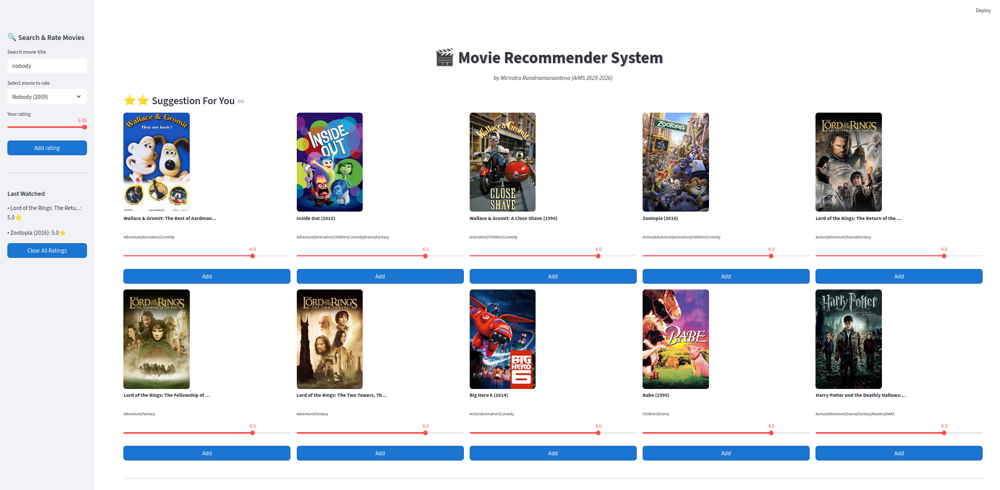
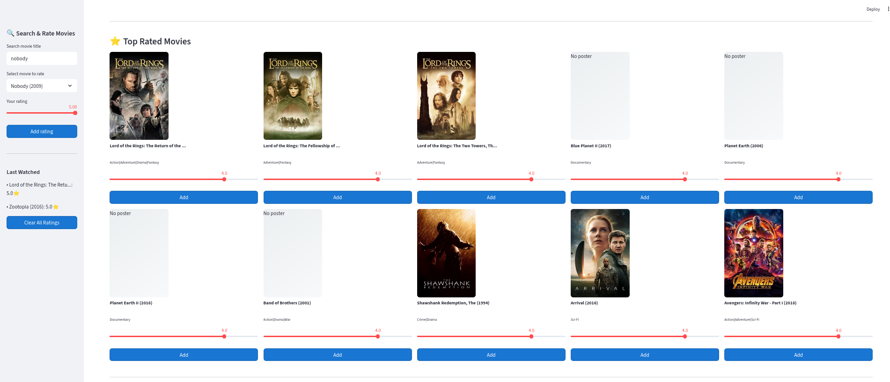

# Large-scale-movie-recommendation
A from-scratch implementation of a scalable movie recommendation system. 


🎬 Movie Recommendation System
A collaborative filtering movie recommendation system using ALS (Alternating Least Squares) matrix factorization with genre features.

The notebook ipynb documents each development step. The last notebook is the last version and used as basis in this application.


Features :

Pre-trained Model: Get recommendations instantly with our pre-trained model (105MB)

Custom Training: Train your own model from scratch on the MovieLens 25M dataset (with cli only)

Interactive CLI: Search movies, rate them, and get personalized recommendations

Genre-aware: Incorporates movie genres for better recommendations

Fast & Efficient: Optimized with Numba for high performance

Streamlit interface: Web based interface and interactive easy to use

## **Quick Start**
The model or website recommendation is available online on streamlit at:

https://large-scale-movie-recommendation-eptiqpkh7tcuajs288uoxe.streamlit.app/

## Clone the repository
```bash
git clone https://github.com/efandresena/large-scale-movie-recommendation.git
cd large-scale-movie-recommendation
```

## Create and activate a virtual environment
```bash
python3 -m venv venv
source venv/bin/activate
```

## Install dependencies
```bash
pip install -r requirements.txt
```

## Run the application
```bash
python cli.py
```

## For interface using Streamlit 

```bash
streamlit run recommender_system.py
```

## Warning 
For cli or interface the application may take some time to run due to the size of the data to be downloaded and it depends on the user internet speed.
A saved model : 113M
MovielensDataset : 200M (25M)


## Screenshot example

1. **Suggestion for user watched Zootopia and Lord of the Rings**  


2. **Polarizing movie : That people liked the most**  
